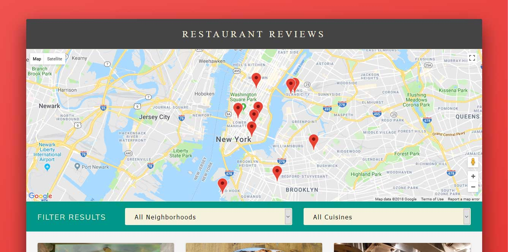

# Restaurant Reviews: Stage 1

This is my entry for project 6 (*Restaurant Reviews App*) from Udacity's  [Front-End Nanodegree](https://www.udacity.com/course/front-end-web-developer-nanodegree--nd001) program.
Find starter code and more information [HERE
](https://github.com/udacity/mws-restaurant-stage-1)

[](https://amr-adel.github.io/fend-p6-restaurant-reviews/)

### Criteria

#### Responsive Design
- All content is responsive and displays on a range of display sizes.
- Content should make use of available screen real estate and should display correctly at all screen sizes.
- An image's associated title and text renders next to the image in all viewport sizes.
- Images in the site are sized appropriate to the viewport and do not crowd or overlap other elements in the browser, regardless of viewport size.
- On the main page, restaurants and images are displayed in all viewports. The detail page includes a map, hours and reviews in all viewports.

#### Accessibility
- All content-related images include appropriate alternate text that clearly describes the content of the image. 
- Focus is appropriately managed allowing users to noticeably tab through each of the important elements of the page. Modal or interstitial windows appropriately lock focus.
- Elements on the page use the appropriate semantic elements. For those elements in which a semantic element is not available, appropriate ARIA roles are defined.

#### Offline Availability
- When available in the browser, the site uses a service worker to cache responses to requests for site assets. Visited pages are rendered when there is no network access.

---

### To see it in action
#### Visit repository GitHub page

[Restaurant Reviews App Demo](https://amr-adel.github.io/fend-p6-restaurant-reviews/)

---

#### Clone repository
via `HTTPS` 
```
https://github.com/amr-adel/fend-p6-restaurant-reviews.git
```
Or via `SSH` 
```
git@github.com:amr-adel/fend-p6-restaurant-reviews.git
```

---

#### Or download repository
As a ZIP archive [Restaurant Reviews: Stage 1](https://github.com/amr-adel/fend-p6-restaurant-reviews/archive/master.zip)

1- In this folder, start up a simple HTTP server to serve up the site files on your local computer. Python has some simple tools to do this, and you don't even need to know Python. For most people, it's already installed on your computer.

>>> In a terminal, check the version of Python you have: `python -V`. If you have Python 2.x, spin up the server with python `-m SimpleHTTPServer 8000` (or some other port, if port 8000 is already in use.) For Python 3.x, you can use python3 `-m http.server 8000`. If you don't have Python installed, navigate to Python's website to download and install the software.

2- With your server running, visit the site: `http://localhost:8000`, and look around for a bit to see what the current experience looks like.
